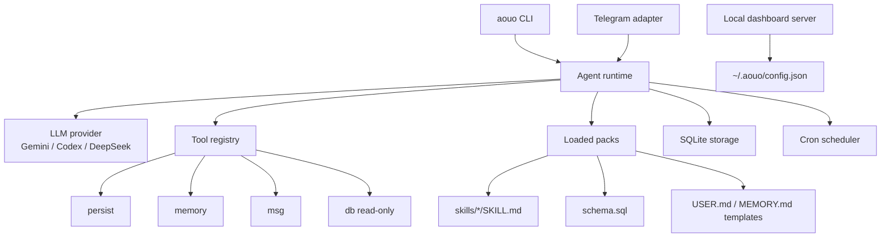
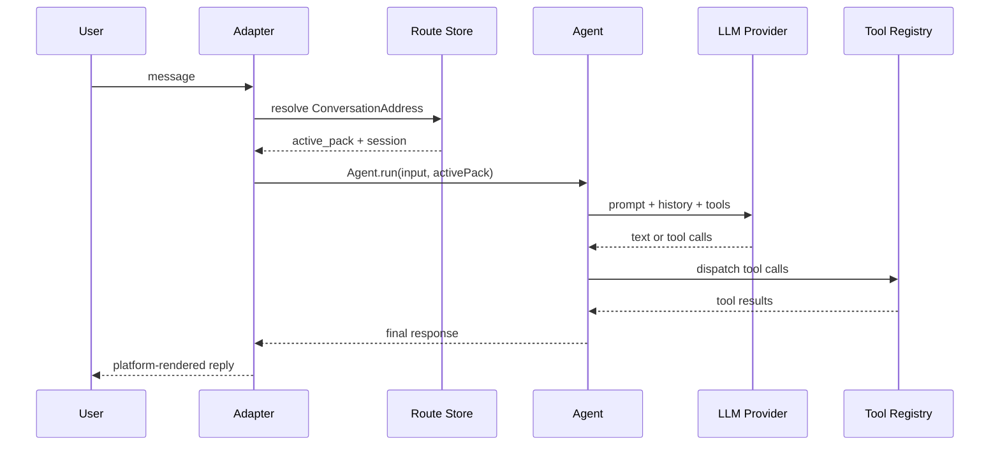

# Architecture

aouo is a local-first vertical agent runtime. The repository is a monorepo, but the product is intentionally one main runtime package: `@aouo/agent`.

The runtime owns the CLI, provider abstraction, pack loader, ReAct loop, tools, storage, Telegram adapter, cron scheduler, and local dashboard server.

## Repository shape

```text
aouo/
├── packages/
│   ├── agent/       # @aouo/agent: CLI + runtime + adapters + tools
│   └── dashboard/   # local Web UI bundle served by aouo ui
├── apps/
│   └── notes/       # first built-in vertical pack
└── packages/docs/   # Astro + Starlight docs and landing page
```

## Runtime layers



## Agent loop

`Agent.run()` is the central execution path.

1. Resolve or create a session.
2. Resolve the active pack from the caller.
3. Build the system prompt from `SOUL.md`, `RULES.md`, loaded packs, memory, and skill index.
4. Call the active LLM provider.
5. Dispatch tool calls through the tool registry.
6. Save history and return the final response.



## Pack boundary

The important boundary is pack scope.

- Packs are vertical apps.
- Skills are workflows inside a pack.
- Persist writes are scoped to the active pack.
- Memory files are scoped to the active pack.
- Multi-pack conversations require an explicit active pack.

If multiple packs are loaded and no active pack is selected, the runtime refuses the LLM call with `RouteRequiredError`. The Telegram adapter catches that and shows a pack picker.

## Storage

aouo stores runtime state under `~/.aouo/`.

| Path | Purpose |
|------|---------|
| `~/.aouo/config.json` | Provider, tool, Telegram, cron, and pack configuration |
| `~/.aouo/SOUL.md` | Core agent identity |
| `~/.aouo/RULES.md` | Core runtime rules |
| `~/.aouo/packs/` | Linked or installed pack sources |
| `~/.aouo/data/` | SQLite store and pack-scoped mutable state |

## Adapters

Adapters translate platform events into agent runs and translate `msg` intents back into platform-native messages.

Telegram currently implements:

- user allowlist enforcement
- conversation route resolution
- `/pack`, `/use`, `/whereami`, `/new`
- text, voice, photo, callback, and poll handling
- platform-specific rendering for `msg`

Future adapters should keep their own platform rules instead of inheriting Telegram message assumptions.

## Local dashboard

`aouo ui` starts a local dashboard server on `127.0.0.1`.

The server uses `node:http`, serves the built dashboard SPA, and protects `/api/*` with an ephemeral token in the launch URL. It is intended for local configuration and inspection, not cloud hosting.
