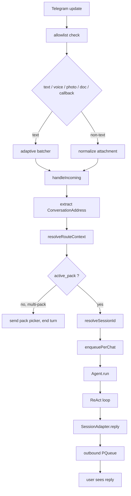
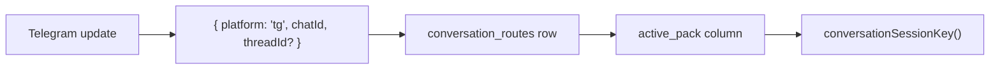
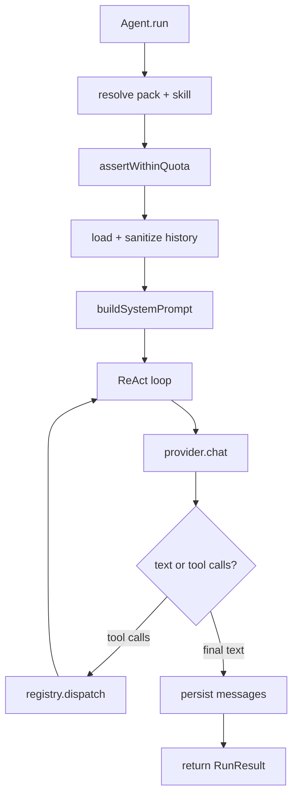

A "turn" is what happens between a user sending a message and the bot finishing its reply. This page traces the full pipeline through the runtime — useful when you are debugging latency, message ordering, lost replies, or skill-side effects that did not stick.

The pipeline is the same shape for any future channel. Telegram-specific glue is named where it appears.

## End-to-end diagram



The pipeline has four phases: **inbound normalization**, **route resolution**, **agent execution**, **outbound rendering**.

## Phase 1 — Inbound normalization

### Allowlist gate

Before anything else, the inbound user id is checked against `telegram.allowed_user_ids`. Unauthorized users get one short reply and the pipeline ends. An empty allowlist denies everyone.

### Attachment handling

| Type | What happens before `handleIncoming` |
| --- | --- |
| Text | Pass straight through (subject to batching, below) |
| Voice (OGG/Opus) | Download → `lib/stt.ts` transcribes via Groq Whisper → transcript becomes the agent input; the original file path is preserved on the conversation context so skills can re-access the audio |
| Photo | Download largest size → file path passed to the vision-capable provider (Gemini / OpenAI 4o-class / Codex) inline with the caption text |
| Document | Download → expose file path on the conversation context; the agent decides how to use it |

If STT or vision is unavailable (no API key, network failure), the adapter degrades to a short user-facing error and the turn ends — it does not try to silently call the LLM with a placeholder.

### Adaptive inbound batching

Text messages flow through `messageBatcher` before they hit `handleIncoming`:

- Configured by `telegram.message_batch_ms` in `~/.aouo/config.json` (set `0` or omit to disable).
- Keyed by the per-chat queue key (`<chatId>:<threadId>` for topics, `<chatId>` otherwise).
- New message arriving inside the window appends to the batch and resets the timer.
- Timer fires → `texts.join('\n')` is sent as one inbound to `handleIncoming`.
- Long messages (above an internal length threshold) flush the batch immediately to keep latency low.

Voice, photo, document, and commands **never batch** — they are structured inputs where coalescing would scramble the meaning.

## Phase 2 — Route resolution

`handleIncoming` calls `resolveRouteContext`, which returns the four-tuple that defines a turn's identity:

```ts
{ address, route, activePack, sessionKey }
```

The full identity model lives in [Pack Routing](/internals/pack-routing/). The short version:



### Picker short-circuit

If multiple packs are loaded **and** the route has no `active_pack` **and** the inbound is not a command, the adapter sends the pack picker and ends the turn without invoking the agent. The next callback (`pack:<name>`) writes `active_pack` and replays the inbound.

Single-pack runtimes skip this entirely — the only loaded pack is auto-bound.

### Session validation (`resolveSessionId`)

Before reusing `route.session_id`, the adapter validates that `sessions.session_key` equals the freshly computed `sessionKey`. If they don't match, the route's pointer is stale (the route was bound under a different pack/topic and the row was not migrated). The adapter:

1. Logs `tg_route_session_stale` with both keys for postmortem.
2. Mints a fresh session for the current `sessionKey` via `getOrCreateSession`.
3. Updates the route to point at the new session id.

This is what prevents the classic "I switched packs but the bot still remembers the wrong domain" bug.

## Phase 3 — Agent execution

Once routing is resolved, the work is wrapped in an async closure and submitted to `enqueuePerChat`. Inside that queue, `Agent.run` executes the ReAct loop.

### Agent.run lifecycle



Order matters:

1. **Pack + skill resolution** — `activePack` is required when multiple packs are loaded; `RouteRequiredError` is thrown otherwise. The skill resolver is a closure that captures `activePack` so bare skill names look up `${activePack}:<bare>` first. See [Pack Routing → Skill resolver closure](/internals/pack-routing/#skill-resolver-closure).
2. **Quota gate** — `assertWithinQuota` reads daily and per-session caps from `config.advanced` and reads `usage_events` to compute the running totals. Throws `QuotaExceededError` before any LLM call is made.
3. **History loading** — recent messages for `sessionKey` are loaded, sanitized (drop trailing partial tool calls, dedupe), and compressed by `ContextCompressor` when token estimates exceed the threshold.
4. **System prompt** — built from `SOUL.md`, `RULES.md`, the active pack's manifest, the active skill body (if any), memory templates (`USER.md` + `MEMORY.md`), and the skill index.
5. **ReAct loop** — `provider.chat(messages, tools)` either returns text (terminal) or tool calls. Tool calls dispatch through the tool registry; results are appended as `tool` messages and the loop continues.
6. **Persist** — the full message list is committed back to `messages` via `sessionStore`. `usage_events` rows are written for the LLM + every tool call.

### Tool dispatch

Tools are looked up by name in the registry (`tools/registry.ts`) and called with a `ToolContext`:

```ts
interface ToolContext {
  adapter:    Adapter;       // SessionAdapter for this turn
  config:     AouoConfig;
  sessionId?: string;
  sessionKey?: string;
  pack?:      string;        // captured activePack
}
```

The `pack` field is what makes `skill_view('onboarding')` resolve to the **current** pack's onboarding skill instead of the last-registered pack's. Tools that touch pack-scoped state (`persist`, `memory`, `db`) read this field; tools that don't (`web_search`, `file`) ignore it.

### Streaming tokens

When the provider supports it, the agent passes `onToken: (delta) => sessionAdapter.streamingReply(delta)` into `provider.chat`. The adapter accumulates deltas and edits a single message in place; the throttling rules live in the [Telegram Adapter doc](/internals/telegram-adapter/#streaming-token-replies).

If streaming is disabled (capability flag false or no provider support), the agent collects the full text and the adapter sends it once when the run completes.

## Phase 4 — Outbound rendering

The agent talks to the adapter through three methods, in roughly this order:

| Method | When | Purpose |
| --- | --- | --- |
| `sendThinking()` | Start of run | Create the status message |
| `showToolCall(name, args)` | Before each tool call | Update status text in place |
| `showToolResult()` | After tool returns | Reset status to "Thinking…" |
| `streamingReply(token)` | Per token (if enabled) | Edit content message with running buffer |
| `dispatchMessage(payload)` | When a skill calls the `msg` tool | Send a structured message intent (photo, voice, keyboard…) |
| `reply(text)` | End of run | Send the final reply text |

### `dispatchMessage` routing

The `msg` tool produces an `AdapterMessagePayload` discriminated union — the seven shipped types are `text`, `photo`, `audio`, `voice`, `document`, `keyboard`, `action`. Each maps to one Telegram API call:

| Payload | Telegram call |
| --- | --- |
| `text` | `sendMessage` |
| `photo` | `sendPhoto` |
| `audio` | `sendAudio` |
| `voice` | `sendVoice` |
| `document` | `sendDocument` |
| `keyboard` | `sendMessage` + `reply_markup` |
| `action` | `sendChatAction` (typing, upload_voice, …) |

The handler returns `{ ok, messageId, sentContent }` — `sentContent: true` tells the final `reply()` to skip duplicating the same text.

### Capability-aware degrade

Before `dispatchMessage` runs, `tools/message.ts` calls `degradeMessagePayload(payload, capabilities)`. The rules:

| Original | Capability missing | Degrades to | Note attached |
| --- | --- | --- | --- |
| `photo` | `caps.photo` | `text` with the caption | "photo not supported" |
| `voice` | `caps.voice` but `caps.audio` | `audio` (same URL) | "voice rendered as audio" |
| `voice` | both `caps.voice` and `caps.audio` | `text` with the URL | "voice not supported" |
| `audio` | `caps.audio` | `text` | "audio not supported" |
| `document` | `caps.document` | `text` with the URL | "document not supported" |
| `text`, `keyboard`, `action` | n/a | unchanged (baseline) | none |

The degradation note is surfaced to the LLM as a tool result so the next turn can react ("I tried to send a voice note but the platform does not support it — sent text instead"). This is how skills stay portable across channels with different capability sets.

### Outbound ordering (`PQueue`)

Inside `SessionAdapter`, every Telegram API call goes through `new PQueue({ concurrency: 1 })`. This guarantees that if a skill fires `dispatchMessage(photo)` then `dispatchMessage(text)` then `reply(final)`, the user sees them in that exact order even though Grammy is asynchronous and Telegram's per-chat rate limit is fuzzy.

### Pack badge

When two or more packs are loaded **and** the conversation is in a private chat (not a forum topic — the topic title already labels the pack), the final `reply()` appends `\n\n— <packName>` so the user can see which pack answered. Forum topics and single-pack setups skip the badge to keep the chat clean.

## Failure modes

| Failure | What the user sees | Where it is logged |
| --- | --- | --- |
| Allowlist rejected | "you are not authorized" | `tg_auth_denied` |
| Quota exceeded | short message naming the cap (session or daily) | `quota_exceeded` |
| Provider error (rate limit, network) | classified by `errorClassifier`; transient errors trigger one retry on a fallback provider if configured | `provider_error`, `provider_failover` |
| Tool error | tool result becomes an error message and the agent decides how to respond | tool name + `tool_error` |
| Stale session pointer | invisible — `resolveSessionId` self-heals | `tg_route_session_stale` |
| Unknown callback prefix | passed to `handleIncoming` as a fresh inbound (tier 3 fallthrough) | none |
| Forum topic without `active_pack` and no title match | pack picker is sent inside the topic | none |

All log entries are pino with global secret redact; check `~/.aouo/logs/` after the fact.

## Where to instrument

- **Latency** — wrap the body of `Agent.run` in a timer; subtract `provider.chat` time to isolate runtime overhead.
- **Cost** — `usage_events` rows are the source of truth (`scope`, `provider`, `model`, `input_tokens`, `output_tokens`, `created_at`). The local dashboard reads these directly.
- **Cross-talk regressions** — grep logs for `tg_route_session_stale`. A spike there means session validation is catching what a previous regression would have leaked.
- **Streaming health** — count `editMessageText` calls against token counts; if the ratio approaches 1 you are missing the debounce.

## Related docs

- [Telegram Adapter Internals](/internals/telegram-adapter/) — bot lifecycle, command surface, callback routing
- [Pack Routing](/internals/pack-routing/) — identity model: route, session key, qualified skills
- [Architecture](/concepts/architecture/) — high-level layer diagram
