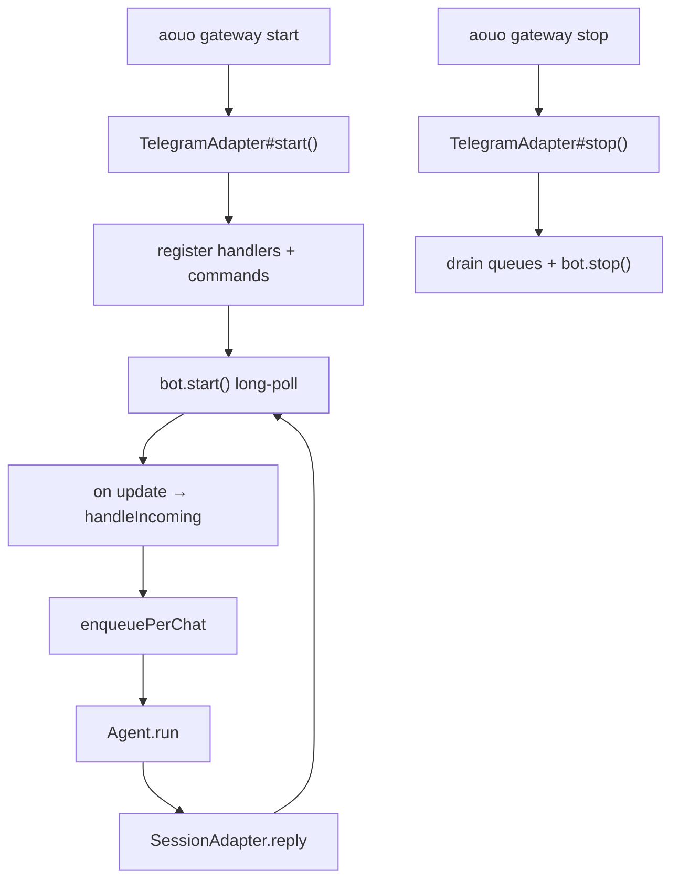
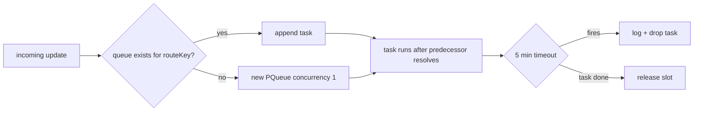
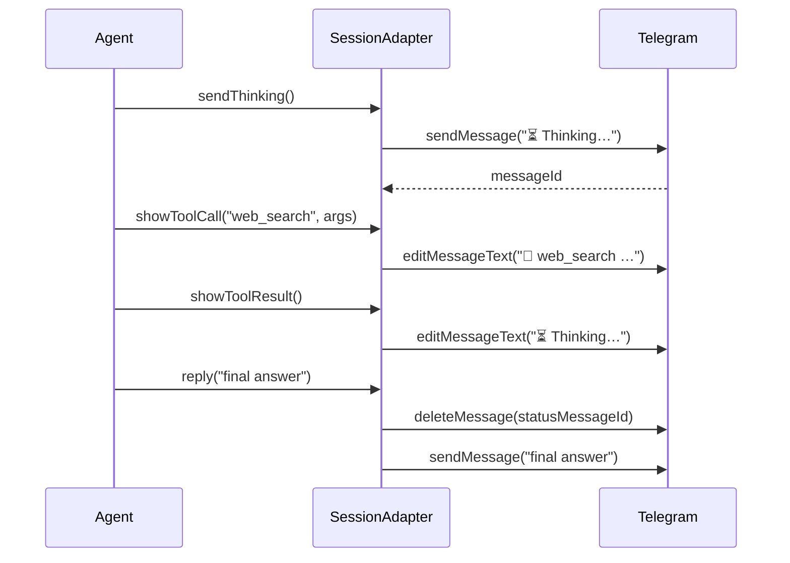
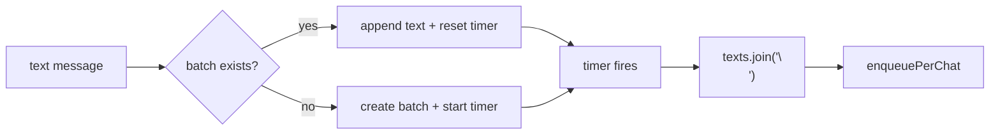

This is the engineering blueprint for the Telegram adapter. If you are extending it (adding a command, a callback prefix, a new inbound type) or porting it to another channel, start here. For the user-facing view, see [Telegram Runtime](/runtime/telegram/).

All citations are file paths into [`packages/agent/src/adapters/telegram/`](https://github.com/aouoai/aouo/tree/main/packages/agent/src/adapters/telegram).

## Class layout

The adapter is two classes plus a small `routing.ts` helper module.

| File | Role |
| --- | --- |
| `TelegramAdapter.ts` | Bot lifecycle, command surface, callback routing, per-chat queues, inbound dispatch, daemon entrypoint |
| `SessionAdapter.ts` | Per-turn `Adapter` implementation passed into `Agent.run`: reply, status messages, streaming edits, message dispatch |
| `routing.ts` | Pure helpers: build `ConversationAddress` from a Grammy `Context`, extract forum-topic id, build the pack-picker keyboard |
| `markdown.ts` | Telegram-HTML conversion + paragraph-safe length split |
| `errors.ts` | Format Telegram API errors into actionable lines |

`TelegramAdapter` is the long-lived daemon process. `SessionAdapter` is built **once per turn** inside `handleIncoming` and discarded after the agent run completes.

## Lifecycle



- **Construction** — `TelegramAdapter` is built from `(config, provider)`; it owns one `Bot` instance from Grammy, the cron scheduler, and several in-memory maps (per-chat queues, pending approvals, pending choices, message batcher).
- **`start()`** registers every handler (`bot.command`, `bot.on(...)`, `bot.on('callback_query', ...)`), pulls `provided_commands` out of each loaded pack's skills, and calls `bot.start()` to enter long-poll mode.
- **`stop()`** drains the per-chat queues, stops the scheduler, and calls `bot.stop()`. The PID file under `~/.aouo/run/` is cleared by the CLI wrapper.

There is no webhook mode — long-poll is the only transport.

## Command surface

Every command is registered in `start()`. Pack-provided commands are appended dynamically.

| Command | Source | What it does |
| --- | --- | --- |
| `/start` | core | Show welcome + pack picker (when ≥1 pack loaded) |
| `/help` | core | Print built-in command list and pack-provided commands |
| `/id` | core | Echo numeric chat id + thread id (useful for the allowlist) |
| `/whereami` | core | Show current pack + active skill + session id for this route |
| `/pack` | core | Show the pack picker (current pack marked with ✅) |
| `/use <name>[:<skill>]` | core | Bind the current route to `<name>` and optionally activate `<skill>` |
| `/new` | core | Start a fresh session on the current route, optionally with a pack's `planner` skill |
| `/setup_topics` | core | In forum supergroups, create one Telegram topic per loaded pack and pre-bind each topic to its pack |
| `/<skill>` | pack | Any skill in a loaded pack that declares `command: true` in its SKILL.md frontmatter is auto-registered |

Skill-as-command collisions (two packs ship a skill with the same bare name as a command) are detected at start: the second registration is dropped and a warning is logged.

## Per-chat queue

`enqueuePerChat(routeKey, task)` is the concurrency boundary. Inside one chat (or one forum topic), turns are strictly ordered; across chats they run in parallel.



Each task races against a 5-minute timeout so a single hung agent run cannot poison the queue for an entire chat. The 5 minutes is the safety net — most runs finish in seconds.

`routeKey` is `<chatId>:<threadId>` when a forum topic is present and `<chatId>` otherwise. The implementation lives in `TelegramAdapter.ts`.

## Authorization

Every inbound update flows through an allowlist check before anything else runs. The check reads `telegram.allowed_user_ids` from `~/.aouo/config.json`. An empty list **denies all** — there is no implicit allow-everyone mode. Unauthorized users get a single short reply and the run ends.

## Callback router

Telegram callback queries (inline-keyboard taps) come through a single handler that dispatches by data prefix. Order matters — the first match wins.

| Prefix | Tier | Handler |
| --- | --- | --- |
| `pack:<name>` | 0 | Pack picker — set or confirm the route's `active_pack` and reset session/skill |
| `choice_<id>` | 1 | Resolve a pending `clarify` tool call by id |
| `approval_<id>` | 1 | Resolve a pending approval (used by gated tools) |
| `nav:<key>` / `menu` | 2 | Deterministic menu / i18n fast-path — answered without invoking the LLM |
| anything else | 3 | Treated as a fresh inbound — sent through `handleIncoming` so a skill can react to it |

Tier 0 is special: the pack picker can fire **before** the route has an active pack, so the route resolver must accept "no active pack yet" as a valid intermediate state.

## Inbound message types

| Type | Handler | Behaviour |
| --- | --- | --- |
| Text | `message:text` | Goes through adaptive batching (if `telegram.message_batch_ms > 0`), then `handleIncoming` |
| Voice | `message:voice` | Download → STT via `lib/stt.ts` → pass transcribed text to `handleIncoming`; original audio kept for skill access |
| Photo | `message:photo` | Download largest size → pass to vision-capable provider; caption merged with the photo URL in the LLM input |
| Document | `message:document` | Download → expose file path to skills via the conversation context |
| Sticker / poll vote / etc. | currently ignored | Future adapters can extend |

All downloads use the shared `fetchWithRetry()` helper in `lib/net.ts` with exponential backoff.

## Status messages (thinking indicator)

The adapter shows a live status line during agent runs by editing one message in place rather than sending many.



The status message is short-lived — it is deleted when the final reply is sent (or replaced by an error line if the run failed). `SessionAdapter` owns the `statusMessageId` for the duration of one turn.

## Streaming token replies

When the provider supports token-level streaming and the adapter's `editMessage` capability is true, `SessionAdapter.streamingReply(token)` accumulates tokens and edits the **content** message (not the status message) in place.

Two thresholds guard against Telegram rate limits:

| Threshold | Constant | Default |
| --- | --- | --- |
| Minimum buffered characters before an edit | `STREAM_MIN_BUFFER` | 50 |
| Minimum interval between edits | `STREAM_MIN_INTERVAL_MS` | 800 ms |

Telegram caps message edits at roughly 30/second/chat globally; 800 ms is conservative.

If `editMessage` capability is false, streaming is disabled and the full reply is sent once when the agent run completes.

## Adaptive inbound batching

Rapid-fire short messages from one user are coalesced into a single agent turn to save LLM cost. Long messages skip batching to keep latency low.



- Trigger: text inbound only — voice, photo, document, and commands bypass the batcher.
- Window: `telegram.message_batch_ms` (set to `0` to disable; the implementation only batches when the config value is positive).
- Long-message bypass: messages above an internal length threshold flush the batch immediately.

The batch state is `messageBatcher: Map<routeKey, { texts, ctx, timer }>` keyed by the per-chat queue key. Restarting the gateway clears the in-flight batches; persistent batching across restarts is intentionally not implemented.

## Forum topics

In Telegram supergroups marked `is_forum`, every topic gets its own `threadId`. The adapter treats `(chatId, threadId)` as the routing identity — see [Pack Routing](/internals/pack-routing/) for how this turns into pack scope.

`/setup_topics` automates the common workflow:

1. Iterate every loaded pack.
2. Call `bot.api.createForumTopic(chatId, packName)`.
3. Write a `conversation_routes` row with the new `thread_id` and `active_pack = packName`.
4. Report a short summary back to the user.

When inbound traffic arrives from a forum topic and the route has no `active_pack`, the adapter does a best-effort match against the topic title to auto-bind. Users who renamed topics by hand can always re-pick via `/pack` inside that topic.

`createForumTopic` requires the bot to be a supergroup admin with `can_manage_topics`. Failures are surfaced as a single error line; the partial work (topics already created) is left in place.

## Capabilities

`SessionAdapter.capabilities` declares what message shapes the channel supports. The current declaration:

```ts
readonly capabilities: AdapterCapabilities = {
  photo: true,
  voice: true,
  audio: true,
  document: true,
  editMessage: true,
};
```

`tools/message.ts` consults these flags before sending and degrades unsupported types to text. See [Message Pipeline → Capability-aware degrade](/internals/message-pipeline/#capability-aware-degrade) for the rules.

## Extending the adapter

| Goal | Where to look |
| --- | --- |
| Add a built-in command | `start()` in `TelegramAdapter.ts` — copy an existing `bot.command(...)` block |
| Add a callback prefix | Callback router in `TelegramAdapter.ts` — insert above tier 3 |
| Add an inbound media type | `bot.on('message:<type>', ...)` handler + a download helper if needed |
| Add a status indicator variant | `SessionAdapter.showToolCall` / `flushStatus` |
| Add a new message form | Extend `AdapterMessagePayload`, add a handler in `dispatchMessage`, update `capabilities`, update `degradeMessagePayload` in `tools/message.ts` |
| Port to another platform | Implement the `Adapter` interface from `agent/types.ts`; the agent loop does not assume Telegram |

The agent core has zero Telegram-specific knowledge. Everything Telegram-shaped lives in this directory.
