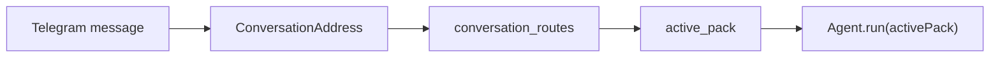

# Telegram Runtime

Telegram is the first supported channel for the aouo MVP. The Telegram adapter owns bot lifecycle, user authorization, message normalization, pack routing, and rendering of platform-neutral message intents.

## Start the gateway

```bash
aouo gateway start
```

Useful lifecycle commands:

```bash
aouo gateway status
aouo gateway stop
aouo gateway restart
```

## Authorization

Telegram access is controlled by `telegram.allowed_user_ids`.

```json
{
  "telegram": {
    "enabled": true,
    "bot_token": "YOUR_BOT_TOKEN",
    "allowed_user_ids": [123456789]
  }
}
```

Use [@userinfobot](https://t.me/userinfobot) to find your numeric Telegram user ID.

<Warning>
  Keep the allowlist explicit for real use. The bot can receive messages from anyone who can reach it unless the runtime rejects unauthorized users.
</Warning>

## Pack routing

Every Telegram conversation is converted into a `ConversationAddress`, then resolved through the route store.



Routing rules:

- If zero packs are loaded, the adapter refuses the turn and asks you to link a pack.
- If one pack is loaded, aouo binds the conversation to that pack automatically.
- If multiple packs are loaded and no active pack is set, the adapter shows a pack picker before the LLM is called.
- The agent also enforces this boundary with `RouteRequiredError`, so ambiguous multi-pack runs do not silently write to the wrong pack.

## Commands

The Telegram adapter exposes runtime commands for pack selection and session management:

| Command | Purpose |
|---------|---------|
| `/pack` | Show available packs and choose the active one |
| `/use <pack>` | Switch the current conversation to a pack |
| `/whereami` | Show current pack, skill, and session route |
| `/new` | Start a fresh session while keeping the active pack |

## Message rendering

Skills use the platform-neutral `msg` tool. Telegram renders that intent into native Telegram messages where possible:

- text
- keyboard
- quiz
- voice/audio/document
- edit/delete/react style operations when supported
- pagination for long messages

Future adapters should implement their own rendering rules instead of reusing Telegram-specific message assumptions.
